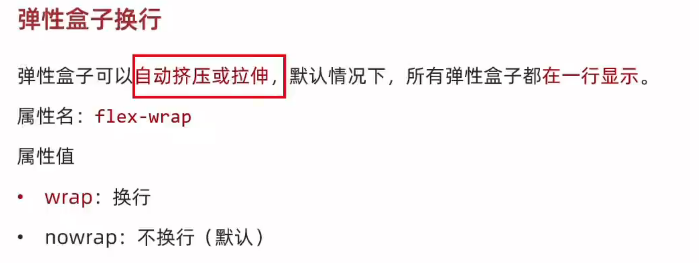

# 转生之我要学习CSS

## 1. 选择器
* 标签选择器 p h1
* 类选择器 class .xxx 多个单词可以- 多个类可以用空格隔开
* id选择器 和class很像但是id一般用js使用 #xxx
* 通配符选择器 * 查找页面所有标签设置相同的样式

## 2. 盒模型
* 文字的模型
* 1. font-weight 可以是数字也可以是关键字 normal bold
* 2. font-style normal italic
* 3. 行高 line-height 属性值是数字+px或者直接是数字表示的font-size 的倍数
* 4. font复合属性 大小和字体必须写
* 5. 文本缩进 text-indent 数字+px和数字+em(常用)
* 6. 颜色的四种表示方式 

## 3 进阶
* 复合选择器
* 1. 后代选择器 空格隔开 所有后代
* 2. 子代选择器 > 
* 3. 并集选择器 逗号隔开各个选择器 建议逗号之后加一个换行
* 4. 交集器选择器 了解 关于使用标签和类 连着p.red
* 伪类选择器 元素状态 被选中元素状态
* 一定要按照从上到下顺序写
* css特性 化简代码  定位问题
* 1. 继承性 body 父级给子级 如果有自己的则不继承
* 2. 层叠性 相同的属性后面会覆盖 不同的会叠加
* 3. 优先级 一个标签使用多种选择器时候 

## 4. 背景
* 
* 1. background-image: url(xxx.jpg) 括号中的是例子
* 2. background-repeat: repeat-x 水平方向 repeat-y 垂直 no-repeat不平铺 repeat 平铺
* 3. background-position（bgp）: 可叠加 空格隔开 数字则是两个数字
* 4. background-size: 关键字 百分比 数字加单位 cover contain等比例放入背景区 
* 5. background-attachment: fixed 固定背景图 属性为fixed、
* 6. background 也是复合属性 色 大小 平铺 位置/缩放 固定

## 5. 显示模式
* 1.  
* 2. 显示转换 

## 6. 结构伪类选择器 与 伪元素选择器（摆放装饰性内容）

是行内元素，不能没有content属性

## 7. 盒子模型(很重要)

* 1. 边框的宽度 border:属性值 线粗细 样式 颜色    、
* 2. 内边距 格式和多值写法 假如要实现居中则可以使用auto 自适应 作用为窗口的宽减去盒子的宽  
* 3. 关于padding 与border会增大盒子 则解决办法
* 4. margin 外边距 合并现象 会根据上下margin合并成一个 取其中最大进行。  塌陷问题，子级的上外边距会将父级直接塌陷下来建议使用第一种方式
* 5. 行内外边距无法使用margin 与padding修改元素垂直位置

## 8. 清除标签默认样式
* 1. 用通配符写margin padding为0 box-sizing:border-box
* 2. 去掉列表的小圆点 list-style:none

## 9. 元素溢出
* 1. overflow:hidden 溢出隐藏 scroll 溢出滚动（无论是夫溢出都显示滚动条位置） auto 溢出滚动（溢出才显示滚动条位置）

## 10. 圆角效果 img也可以使用
* 1. border-radius: 10px 10px 0 0;或者用百分比 左上开始
* 2. 宽高的一半是圆

## 11. 阴影
* 1. box-shadow: 0 0 10px #000;
* x轴偏移量 y轴偏移量 模糊半径 扩散半径 颜色 内外阴影 前两个必须写

## 12. flex
* 1. 标准流就是文档流 就是标签在页面中默认的排布规则
* 2. 浮动 属性名为float 属性值left right  可以使他们在同一行 特点是 顶对齐 具备行内块模式特点 假如一个浮动一个不浮动则会重叠 浮动会脱离标准流的控制 不占用标准流的位置 清除浮动的方法
* 3. 设置了display:flex; 子元素可以自动挤压或拉伸 弹性容器和盒子 主轴默认水平，侧轴默认垂直

## 技巧
* 如果爱要设置单行字居中则将高度和font-size设置为一样的即可
* 调试工具 谷歌浏览器
* Emmet写法 

