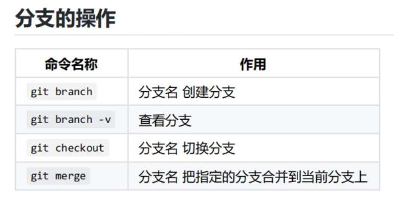

## 学习历程
1. 学习markdown  
	>本地markdown里有教程与学习笔记  

___

2. 学习git github等跨团队合作方式  
	>- 命令  
	> git --version 检查版本    
	
    > ~/.gitconfig 查看设置的配置  
    > git config --global --edit 也可以查看与编写  
	> git rm --cached 文件名  删除暂存区的  
	> ll 查看文件数量  
	> 这里也需要命令行基本语法    
	___
	>- 分支  
	>
	___
	>- github用法  
	> gitpod.io/#可以加在url前面来在线运行代码    
	> 逗号可以进行在线编译  
	> git remote -v 查看仓库  
	> git remote remove 仓库名  
	> git remote add 仓库名 仓库地址  
	> git push 仓库名 分支名  
	> git clone 仓库地址（网址） 
	> git pull 仓库名 分支名 从网站获取到本地  
	> 免密登录第七集第11分钟
	___
