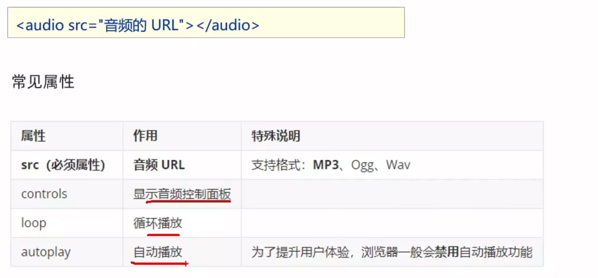
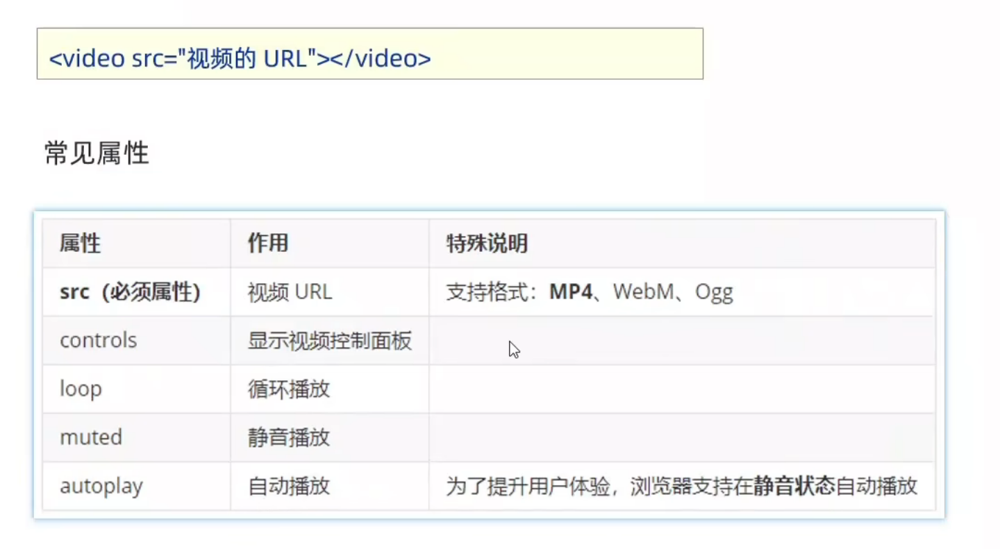
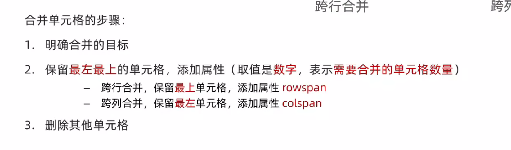
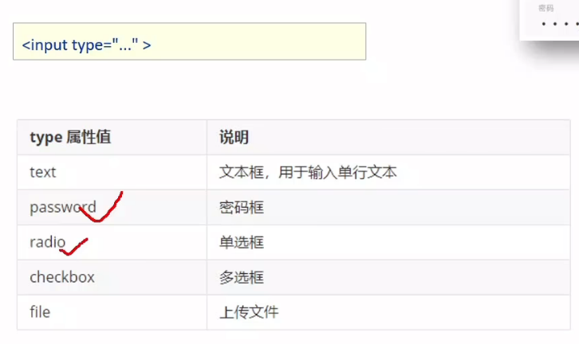
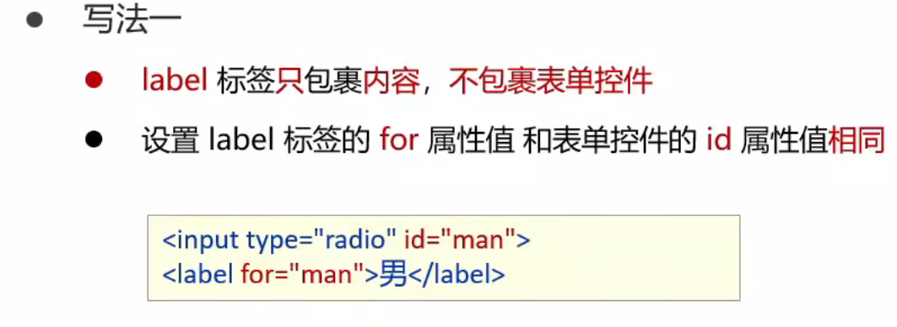
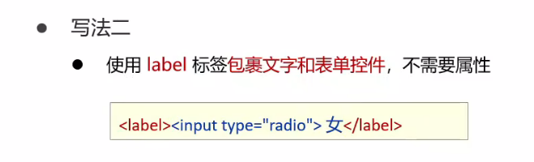
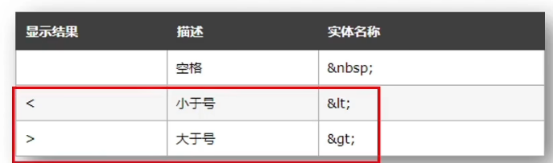
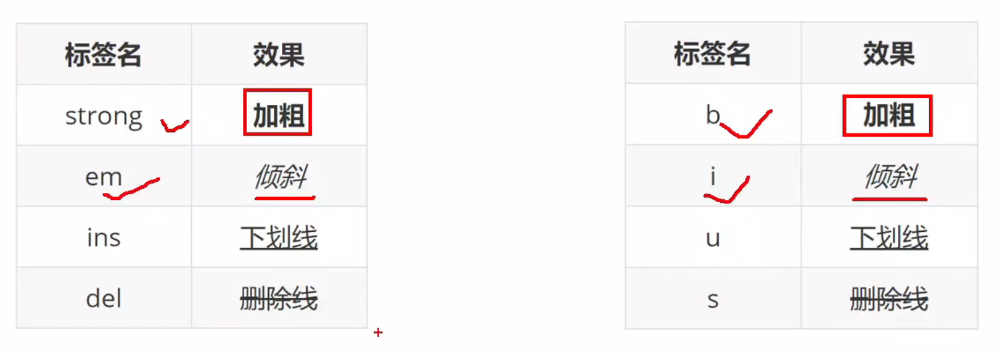
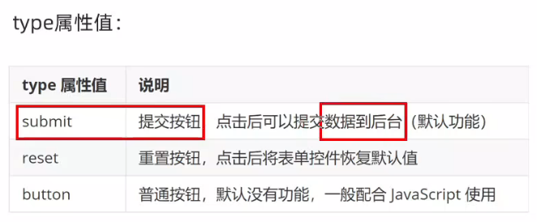

# 重生之我再次学习html的笔记

## 遗漏的知识
-
## 1. shift+tab 往前的缩进一个
## 2. 段落之间有空隙 p
## 3. 音频标签   
## 4. 视频标签  
## 5. 自定义列表 dl dt dd
## 6. 合并单元格  
## 7. 表单的格式 
## 8. #label标签的两种用法   支持文本框，密码框 上传文件，单选框，多选框，下拉菜单，文本域等等 来增大点击范围
## 9. 在代码中写空格只能识别几个空格 

遗忘的知识
-
## 1. br 换行 hr 分割线
## 2. 关于标签各个标签  
   
## 3. 中英文方便记忆 [英语全名记忆](https://blog.csdn.net/qq_40942329/article/details/78879992)
## 4. 按钮button

## 巩固复习区域
-
## 1. 标题   
   >段落p  
   >文本标签上文  
   >图像标签img  
   >超文本标签  
   >音频标签  
   >视频标签  
   >列表标签   
   >表格标签 table tr td th thead tbody tfoot  
   >表单 input  form表单区域
   >下拉菜单 select 嵌套 option  
   >文本域 textarea   
   >按钮 button 
## 2. 无语义的布局标签
    > div 独占一行 大盒子
    > span 不独占一行 不换行 小盒子 
    > 字符实体写空格 > <

